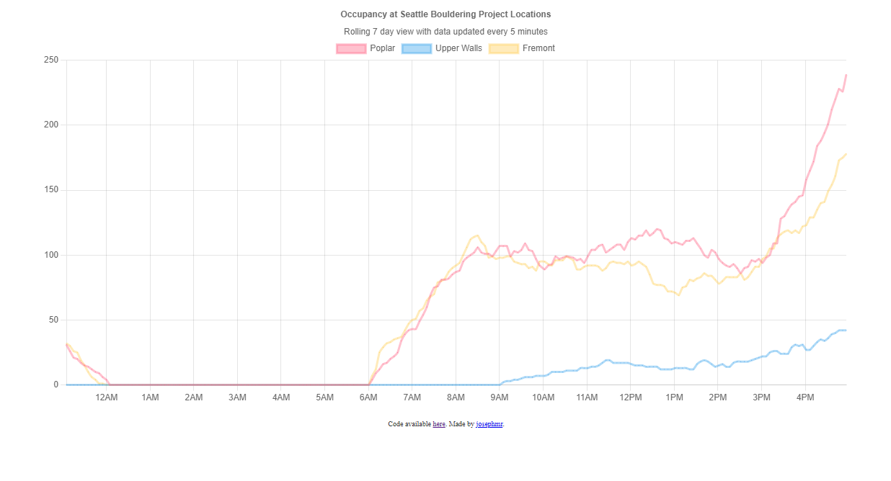

# SBP Tracker

SBP Tracker charts the rolling 7 day occupancy stats for all 3 Seattle Bouldering Project gym locations.

Seattle Bouldering Project is a collection of 3 bouldering gyms in the Seattle area. After re-opening post COVID they published semi real-time occupancy counts at each of their locations on their [website](https://seattleboulderingproject.com/occupancy). These give an estimate of the number of people at the gym at that moment.

